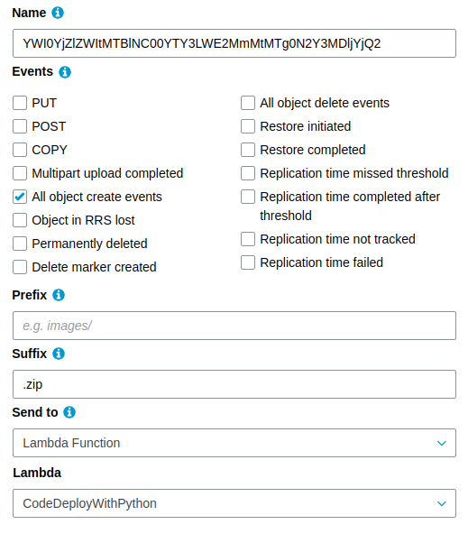

# Lambda Creator
Create a lambda function via using AWS S3 service.

## Features
1. Create a new lambda function 
2. Update old codebase of the lambda
3. You can connect with layer
4. You can add trigger (Currently only S3 event)


#### Function name List 
1. lambda_handler
2. lambda_updater
3. lambda_creator_decider
    - function_creator
        - Lambda creator 
    - lambda_add_permission
      - When need to invoke any service for newly create function. [more details](https://boto3.amazonaws.com/v1/documentation/api/latest/reference/services/lambda.html#Lambda.Client.add_permission)
    - add_s3_event_trigger
        - Bucket trigger event creator. 


### Deploy steps 
1. Create a Role and Policy for Automate Deploy Lambda function in aws iam service. 
You can use this policy json or use full lambda access policy. If you want to give only few accesses the automate lambda 
function then you may use below json policy. 
    ```json
    {
        "Version": "2012-10-17",
        "Statement": [
            {
                "Effect": "Allow",
                "Action": [
                    "cloudwatch:*",
                    "events:*",
                    "lambda:*",
                    "logs:*",
                    "s3:*",
                    "iam:PassRole"
                ],
                "Resource": "*"
            }
        ]
    }
    ``` 
2. Now go to lambda service and create a lambda function and use newly create role and paste the lambda-creator.py 
codebase into in your lambda function.

3. Now create a S3 bucket and setup the event notification with newly create the lambda function. and also set 
suffix as .zip . Because only generate the event when create new object with .zip extension. 
The event should be look like below image

    

4. Finished. 

