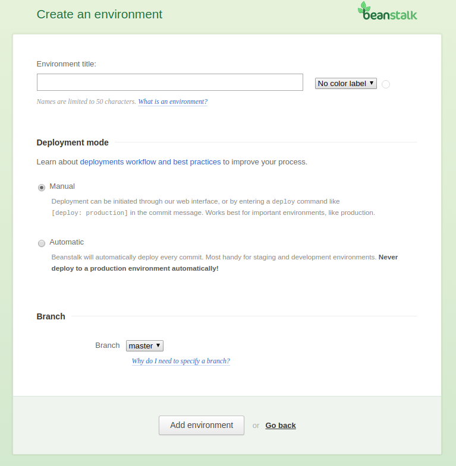
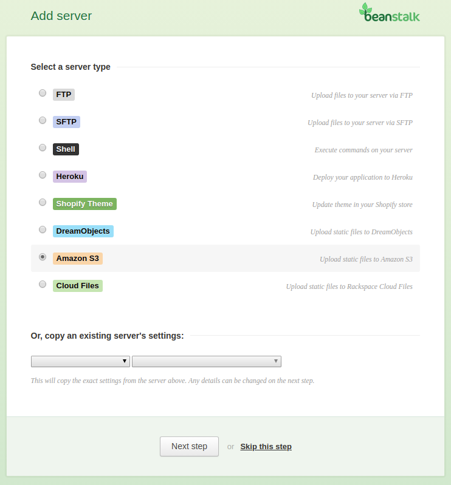

## Details of function.json file 
function.json file has all information of a lambda function setting details.Such as function name, variables so on. 

1. ###### FunctionName:
    - A valid name of the lambda function.
    - Type: String
    - Length Constraints: Minimum length of 1. Maximum length of 140.
    - Pattern: `(arn:(aws[a-zA-Z-]*)?:lambda:)?([a-z]{2}(-gov)?-[a-z]+-\d{1}:)?(\d{12}:)?(function:)?([a-zA-Z0-9-_]+)(:(\$LATEST|[a-zA-Z0-9-_]+))? `
    - Required: Yes
    - Example: HelloWorld
    
2.  ###### Role:
    - The function role ARN 
    - Type: String
    - Required: Yes
    - Example: `arn:aws:iam::< Account ID>:role/< Role Name > `
    
3. ###### Details:
    - The function details. 
    - Type: String
    - Required: No
    
4. ###### Timeout:
    - The lambda function execution duration in second. 
    - Type: Integer
    - Required: No
    - Minimum: `1`
    - Maximum: `900` 
    - Default: `500`
     
5. ###### MemorySize:
    - Lambda function memory size in MB. 
    - Type: Integer
    - Required: No
    - Minimum: `128`
    - Maximum: `3008` 
    - Default: `300`
    
6. ###### Runtime:
    - Lambda function runtime language name:
    - Type: String 
    - Valid Values: `nodejs10.x | nodejs12.x | java8 | java11 | python2.7 | python3.6 | python3.7 | python3.8 | dotnetcore2.1 | go1.x | ruby2.5 | provided`
    - Required: Yes
    
7. ###### Publish:
    - Lambda function will publish or not in creation time. 
    - Type: Boolean
    - Required: No
    - Default: `false`
    - Valid Values: `true` or `false` . True means creation time will publish or false mean won't publish in the creation time. 

8. ###### Layers:
    - You can use lambda function layers. 
    - Type: Array of strings
    - Length Constraints: Minimum length of 1. Maximum length of 140.
    - Pattern: `arn:[a-zA-Z0-9-]+:lambda:[a-zA-Z0-9-]+:\d{12}:layer:[a-zA-Z0-9-_]+:[0-9]+`
    - Required: No
    - Example: 
        ```json
          {  
            "Layers": [
                "<Layer ARN >", 
                "<Layer ARN 2"
            ]
          }   
         ```
 
9. ###### Variables:
    - You can set environment variables. Environment variable key-value pairs.
    - Type: Objects (JSON Objects)
    - Key Pattern:  `[a-zA-Z]([a-zA-Z0-9_])+`
    - Required: No

10. ###### VpcConfig:
    - You can set VPC if you have.
    - Type: Objects (JSON Objects)
    - SubnetIds:
        - Subnet IDs 
        - Type: Array of string 
        - Example: `["subnet-XXXXXXXXX","subnet-XXXXXXXXX"]`
    - SecurityGroupIds:
        - Security Group IDs of the VPC 
        - Type: Array of string 
        - Example: `["sg-XXXXXXXXXXX", "sg-XXXXXXXXXXXXXXXX"]`
    - Required: No 
    - Example: 
        ```json 
             {
                  "VpcConfig": {
                    "SubnetIds": [
                      "subnet-xxxxxxxxxxx",
                      "subnet-xxxxxxxxxxx"
                    ],
                    "SecurityGroupIds": [
                      "sg-xxxxxxxxxxxxxxxx",
                      "sg-xxxxxxxxxxxxxxxx"
                    ]
                  }
             }
        ```
    

11. ###### Notification:
    - You can set event notification s3 bucket to lambda function. 
    - Type: Objects (JSON Objects)
    - Required: No
    - Details:
        - BucketName: 
            - Type: String 
            - Required: Yes
        - Action:
            - Event:
                - Type: Array of strings 
                - Required: Yes
                - Example: `["s3:ObjectCreated:*"]`
                - [See here](https://docs.aws.amazon.com/AmazonS3/latest/dev/NotificationHowTo.html)
    
            - Filter:
                - Notification filter
                - Type: Objects (JSON Objects)
                - Key:
                    - Notification rules 
                    - Type: Objects (JSON Objects)
                    - FilterRules:
                        - You can set here suffix and prefix for event notification of the bucket. 
                        - Type: Array of objects 
                        - Name: 
                            - Name of trigger rule.
                            - Type: String 
                            - Valid Values: suffix or prefix 
                        - Value:
                            - It could be file extension for filter rule of the trigger. 
                            - Type: String 
    - Example:
        ```json
           {   
               "Notification": {
                    "BucketName": "< Bucket Name >",
                    "Action": {
                      "Events": [
                        "s3:ObjectCreated:*"
                      ],
                      "Filter": {
                        "Key": {
                          "FilterRules": [
                            {
                              "Name": "suffix",
                              "Value": ".jpg"
                            }
                          ]
                        }
                      }
                    }
               }
           }   
        ```
      
### A full example

```json
{
  "FunctionName": "< A Valid Lambda Function >",
  "Role": "< Lambda function Role ARN >",
  "Details": "< Lambda Details >",
  "Timeout": 300,
  "MemorySize": 128,
  "Runtime": "python3.8",
  "Publish": true,
  "Layers": [
    "<Layer ARN >"
  ],
  "Variables": {
      "host": "RDS",
      "username": "username",
      "password": "password"
  },
  "VpcConfig": {
    "SubnetIds": [
      "subnet-xxxxxxxxxx",
      "subnet-xxxxxxxxxx"
    ],
    "SecurityGroupIds": [
      "sg-xxxxxxxxxx",
      "sg-xxxxxxxxxx"
    ]
  },
  "Notification": {
    "BucketName": "< Bucket Name >",
    "Action": {
      "Events": [
        "s3:ObjectCreated:*"
      ],
      "Filter": {
        "Key": {
          "FilterRules": [
            {
              "Name": "suffix",
              "Value": ".jpg"
            }
          ]
        }
      }
    }
  }
}

```

## Testing 

1.  ###### AWS CLI Method
    - You should have install AWS CLI
    - Go to example directory and change necessary information of function.json file
    - Now make a zip file of the lambda_function.py file 
    - Upload zip file and function.json file into your newly created s3 bucket by below command 
    - aws s3 sync . s3://sol-lambda-deploy --exclude "*.py"
    - [More details AWS S3 CLI](https://docs.aws.amazon.com/cli/latest/userguide/cli-services-s3-commands.html)
    
2. ###### Beanstalkapp Method
    - Go to beanstalk website. [visit](https://beanstalkapp.com)
    - Go to your repository and click on development option. Give environment name and select your branch name.
     Select manual or automatic option. If you want to deploy the codebase on git push. You need to select automatic option. 
    
    - Now select amazon s3 server
    
    - Now give name in the general settings and select your s3 bucket region 
      and set your access key and secret key and bucket name.
    
    - Save now and finish. Now you are able to push your codebase directly amazon s3 bucket. 
    [N.B. Codebase should in zip file]
    